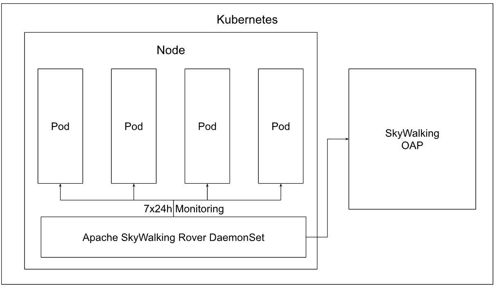

# Overview

SkyWalking Rover is an open-source collector, which provides a metrics collector and eBPF-based profiler for C, C++, and Golang.

## Why use SkyWalking Rover?

On the Linux platform, we could collect a lot of telemetry data. Rover could collect them based on the eBPF technology,
and upload them to the SkyWalking backend for analysis, aggregate, and visualize them.

1. EBPF based profiling for C, C++, and Golang.
2. Infrastructure metrics collector for VM, Process, etc.
3. Optimized the network performance.

## Architecture

- **Process** represents the data that need to be monitored by Rover.
- **Rover** is deployed in the VM instance, collects data in VM and Process, and reports it to the OAP cluster.
- **OAP** collect data from the rover side, analysis, and storage them.